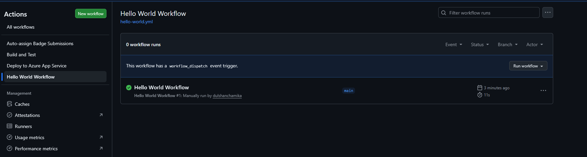
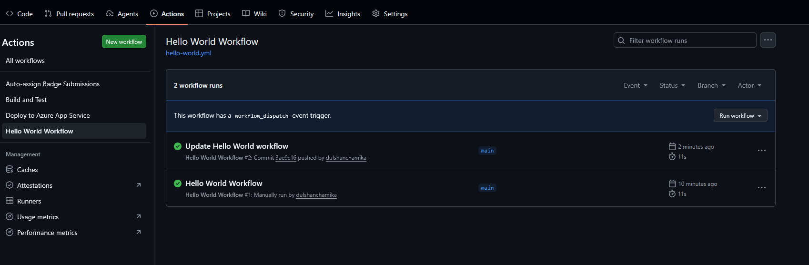
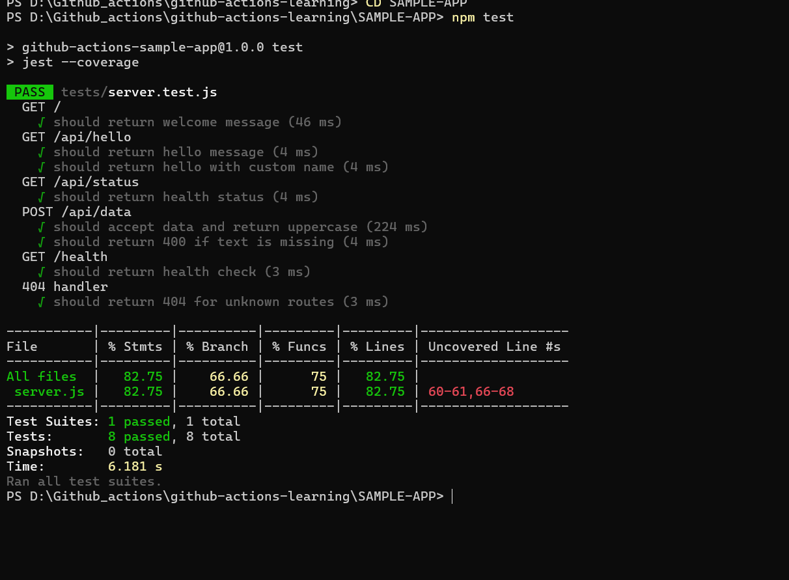
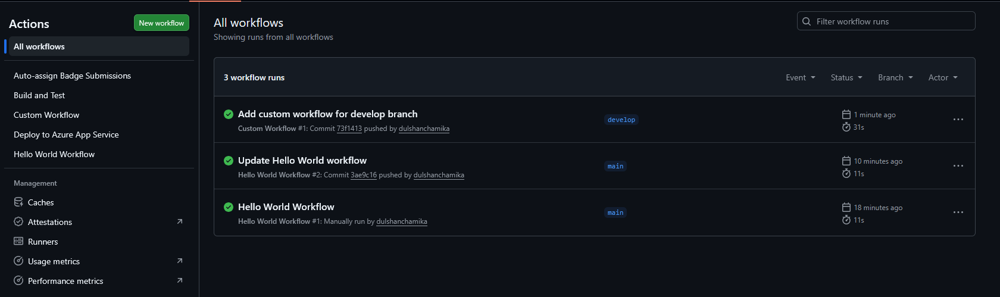
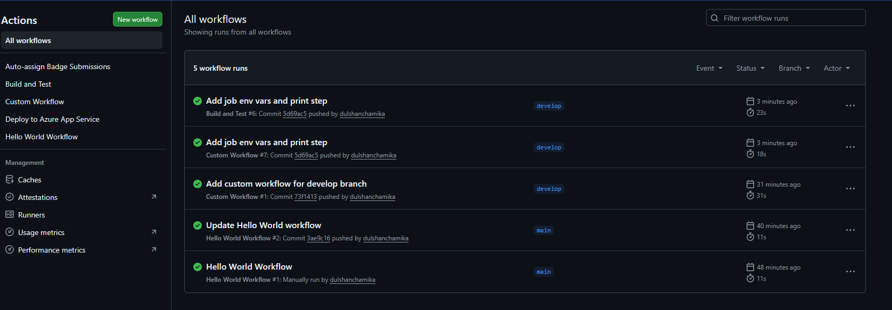
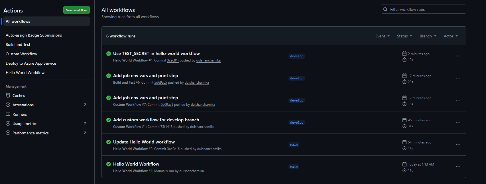
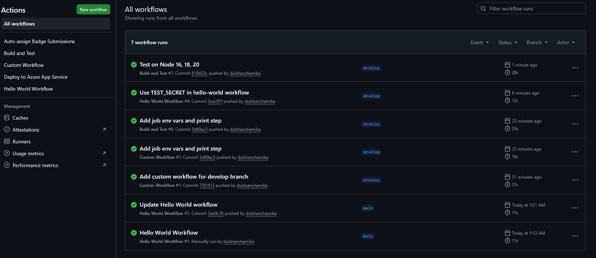
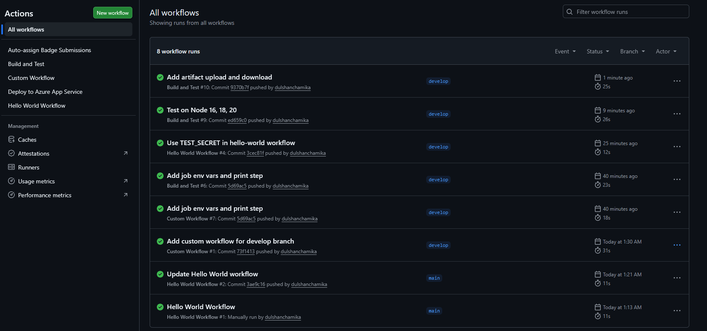

# Advanced Badge Submission - Dulshan Chamika

**Date:** February 2026
**Status:** Submitted for Review

## Tasks Completed

- [x] Task 1: Run Your First Workflow
- [x] Task 2: Understand Workflow Triggers
- [x] Task 3: Build and Test Locally
- [x] Task 4: Create a Custom Workflow
- [x] Task 5: Add Environment Variables
- [x] Task 6: Use GitHub Secrets
- [x] Task 7: Matrix Testing
- [x] Task 8: Upload and Download Artifacts
- [x] Task 9: Conditional Execution
- [x] Task 10: Create a PR and Use Issue Templates

## Evidence

### Task 1: Hello World Workflow
(screenshots/task1-2.png)

### Task 2: Push Trigger
(screenshots/task2-2.png)

### Task 3: Local Tests
(screenshots/task3-2.png)(screenshots/task3-1.png)

### Task 4: Create a Custom Workflow
(screenshots/task4-2.png)

### Task 5: Add Environment Variables
(screenshots/task5-2.png)(screenshots/task5-3.png)

### Task 6: Use GitHub Secrets
(screenshots/task6-2.png)

### Task 7: Matrix Testing
(screenshots/task7-2.png)

### Task 8: Upload and Download Artifacts
(screenshots/task8-2.png)

### Task 9: Conditional Execution
(screenshots/task9-2.png)(screenshots/task9-3.png)(screenshots/task9-4.png)

## Notes
I had issues with some depricated versions and errors with package-lock.json.

---

Submitted & ready for review! ✅